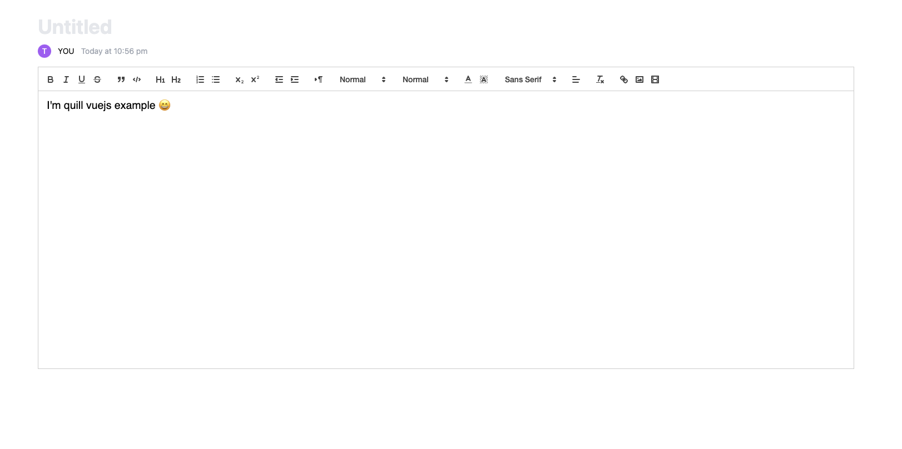

[](https://github.com/cg0101/quill-vuejs/stargazers)
[](https://travis-ci.org/cg0101/quill-vuejs)
[](https://github.com/cg0101/quill-vuejs/issues)
[](https://github.com/cg0101/quill-vuejs/network)
[](https://github.com/cg0101/quill-vuejs)
[](https://github.com/cg0101/quill-vuejs)

[](https://nodei.co/npm/quill-vuejs/)
[](https://nodei.co/npm/quill-vuejs/)


# quill-vuejs

[Quill](https://github.com/quilljs/quill) editor component for Vue.

基于 [Quill](https://github.com/quilljs/quill)、适用于 Vue 的富文本编辑器，支持服务端渲染和单页应用。

## Preview


## Example

- [CDN example page](https://jsfiddle.net/zhangchi/73dbez6h/14/)
- [Component example page](./examples/vue2-component-example/src/App.vue)

### Install

**NPM**

``` bash
npm install quill-vuejs --save

# or
yarn add quill-vuejs
```

**CDN**

``` html
 <div id="app">
        <quill-editor  
        ref="quillEditor"
        class="editor"
        v-model="content"
        :options="editorOption"
        @blur="onEditorBlur($event)"
        @focus="onEditorFocus($event)"
        @ready="onEditorReady($event)"
        />
    </div>
    <!-- Include the Quill library -->
    <script src="https://cdn.quilljs.com/1.3.4/quill.js"></script>
    <script src="https://cdn.jsdelivr.net/npm/vue"></script>
    <!-- Quill JS Vue -->
    <script src="https://cdn.jsdelivr.net/npm/quill-vuejs@0.0.4/dist/quill-vuejs.js"></script>
    <!-- Include stylesheet -->
    <link href="https://cdn.quilljs.com/1.3.4/quill.core.css" rel="stylesheet">
    <link href="https://cdn.quilljs.com/1.3.4/quill.snow.css" rel="stylesheet">
    <link href="https://cdn.quilljs.com/1.3.4/quill.bubble.css" rel="stylesheet">
    <script type="text/javascript">
        Vue.use(window.VueQuillEditor);
        var app = new Vue({
            el: '#app',
            data: {
                content: '<h2>I\'m quill vuejs example</h2>',
                editorOption: {
                    theme: 'snow'
                }
            },
            methods: {
                onEditorBlur(quill) {
                    console.log('editor blur!', quill)
                },
                onEditorFocus(quill) {
                    console.log('editor focus!', quill)
                },
                onEditorReady(quill) {
                    console.log('editor ready!', quill)
                }
            },
            computed: {
                editor() {
                    return this.$refs.quillEditor.quill
                }
            },
            mounted() {
               console.log('this is quill instance object', this.editor)
            }
        });
    </script>
```

### Mount

**Mount with global**

``` javascript
import Vue from 'vue'
import VueQuillEditor from 'quill-vuejs'

import 'quill/dist/quill.core.css' // import styles
import 'quill/dist/quill.snow.css' // for snow theme
import 'quill/dist/quill.bubble.css' // for bubble theme

Vue.use(VueQuillEditor, /* { default global options } */)
```

**Mount with local component**

```javascript
import 'quill/dist/quill.core.css'
import 'quill/dist/quill.snow.css'
import 'quill/dist/quill.bubble.css'

import { quillEditor } from 'quill-vuejs'

export default {
  components: {
    quillEditor
  }
}
```

### Register Quill module

```javascript
import Quill from 'quill'
import yourQuillModule from '../yourModulePath/yourQuillModule.js'
Quill.register('modules/yourQuillModule', yourQuillModule)

// Vue app...
```

### Component

``` vue
<template>
  <!-- Two-way Data-Binding -->
  <quill-editor 
    ref="myQuillEditor"
    v-model="content"
    :options="editorOption"
    @blur="onEditorBlur($event)"
    @focus="onEditorFocus($event)"
    @ready="onEditorReady($event)"
  />

  <!-- Or manually control the data synchronization -->
  <quill-editor
    :content="content"
    :options="editorOption"
    @change="onEditorChange($event)"
  />
</template>

<script>
  // You can also register Quill modules in the component
  import Quill from 'quill'
  import someModule from '../yourModulePath/someQuillModule.js'
  Quill.register('modules/someModule', someModule)
  
  export default {
    data () {
      return {
        content: '<h2>I am Example</h2>',
        editorOption: {
          // Some Quill options...
        }
      }
    },
    methods: {
      onEditorBlur(quill) {
        console.log('editor blur!', quill)
      },
      onEditorFocus(quill) {
        console.log('editor focus!', quill)
      },
      onEditorReady(quill) {
        console.log('editor ready!', quill)
      },
      onEditorChange({ quill, html, text }) {
        console.log('editor change!', quill, html, text)
        this.content = html
      }
    },
    computed: {
      editor() {
        return this.$refs.myQuillEditor.quill
      }
    },
    mounted() {
      console.log('this is current quill instance object', this.editor)
    }
  }
</script>
```

### Projects using quill-vuejs
- 

### Issues
- [Add attributes from toolbar options](https://github.com/quilljs/quill/issues/1084)
- [Option to insert an image from a URL](https://github.com/quilljs/quill/issues/893)
- [How quill-vuejs combine with the syntax highlighter module of highlight.js](https://github.com/surmon-china/vue-quill-editor/issues/39)
- [配合 element-ui 实现上传图片/视频到七牛 demo](https://github.com/surmon-china/vue-quill-editor/issues/102)
- [How to fix “Can’t find variable: Quill”, “Quill is undefined”, “window.Quill is undefined” errors when trying to use Quill modules that use Webpack in Nuxt/SSR](https://github.com/surmon-china/vue-quill-editor/issues/171#issuecomment-370253411)


### Quill Modules
- [quill-image-extend-module](https://github.com/NextBoy/quill-image-extend-module)
- [quill-image-resize-module](https://github.com/kensnyder/quill-image-resize-module)
- [quill-image-drop-module](https://github.com/kensnyder/quill-image-drop-module)
- [quilljs-table](https://github.com/dost/quilljs-table)
- [more modules...](https://github.com/search?o=desc&q=quill+module&s=stars&type=Repositories&utf8=%E2%9C%93)


### Quill
[Quill API document](https://quilljs.com/docs/quickstart/)

